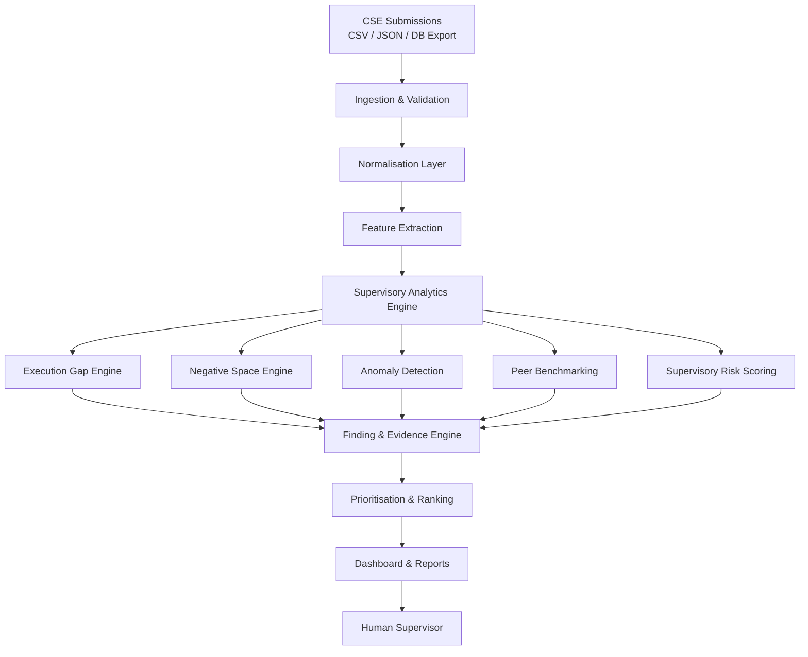

# SAT-SA

**Supervisory Analytics Tool for SOC Assessment**

Smart India Hackathon 2026 · Problem Statement SIH26157 · NCIIPC

> From SOC operational data to evidence-driven supervisory insight.

---

## 1. Executive Overview

The National Critical Information Infrastructure Protection Centre (NCIIPC) assesses the cyber resilience of Critical Sector Entities (CSEs) by manually reviewing samples of security alerts and case-management records produced by Security Operations Centres (SOCs). This manual review is one of NCIIPC's most valuable supervisory mechanisms: it consistently surfaces operational weaknesses that policies, audits, self-assessments, KPI dashboards, and compliance documentation do not reveal.

Manual review, however, does not scale. As the number of CSEs grows and security data volumes increase, supervisors cannot examine enough evidence to maintain coverage. **SAT-SA** is designed to address this gap by analysing SOC alert and case-management data across multiple entities, identifying indicators that warrant human examination, and presenting findings with supporting evidence and rationale. It is a **supervisory analytics capability**, not an operational security tool.

SAT-SA answers a different question than a SOC or SIEM:

| Role | Core Question |
|------|--------------|
| SOC / SIEM | "Is there a cyber attack?" |
| **SAT-SA** | "**Is the SOC operating effectively, and where should a supervisor look next?**" |

SAT-SA does not generate alerts, block threats, or respond to incidents. It transforms operational evidence into **signals → evidence → priorities → human supervisory decisions**.

---

## 2. Problem

NCIIPC's manual supervisory reviews have repeatedly revealed that reported SOC capabilities and actual operational behaviour can diverge significantly. These divergences matter because they indicate weaknesses in detection, investigation, escalation, incident response, governance, and operational discipline that would otherwise go undetected.

The core supervisory problem has two dimensions.

### Execution Gaps

Execution gaps occur when documentation, policies, metrics, or management reports suggest that controls are functioning well, but operational evidence shows otherwise. Supervisory signals include:

- Alerts acknowledged but not meaningfully investigated
- Cases closed unusually quickly, especially high-severity alerts
- Critical alerts closed without appropriate escalation
- Repetitive, template-driven investigations that lack depth
- Controls deployed but not effectively monitored
- Operational behaviour optimised for metrics rather than risk reduction

From a supervisory perspective, execution gaps are dangerous because they create an **illusion of maturity**. An entity may appear compliant while its SOC is not performing meaningful work.

### Negative Space

Negative space occurs where expected evidence is absent. Supervisory signals include:

- Missing telemetry from critical systems
- Absence of expected alert categories
- Missing investigations or escalation records
- Unexpectedly low activity levels relative to asset inventory or peer entities
- Monitoring blind spots
- No evidence of activities that would normally be expected in comparable environments

Negative space is particularly hard to detect through conventional reporting because **absence is invisible** until someone knows what to look for. SAT-SA is designed to surface these absences systematically.

---

## 3. Our Solution

SAT-SA is a supervisory intelligence and analytics platform. It ingests periodic, structured submissions from CSEs, normalises the data, applies supervisory analytics, and presents evidence-backed findings to human examiners.

The end-to-end flow is:

```
CSE Data (alerts, cases, investigations, escalations, asset inventory)
    ↓
Data Ingestion & Validation
    ↓
Normalisation & Feature Extraction
    ↓
Supervisory Analytics Layer
├── Execution Gap Engine
├── Negative Space Engine
├── Anomaly & Outlier Detection
├── Peer Benchmarking
└── Supervisory Risk Scoring
    ↓
Finding & Evidence Engine
    ↓
Manual-Review Prioritisation
    ↓
Dashboard / Supervisory Reports
    ↓
Human Supervisor (final decision)
```

SAT-SA does not make compliance determinations or supervisory conclusions. It produces **findings** — structured observations with rationale, supporting evidence, and recommended review actions. The examiner decides what each finding means and what follow-up is warranted.

---

## 4. What SAT-SA Does

The table below describes the capabilities of SAT-SA. Items marked **Planned** are part of the intended design; items marked **Implemented** are present in the current prototype.

| Capability | Description | Supervisory Value | Status |
|------------|-------------|------------------|--------|
| Multi-CSE Data Ingestion | Accept structured submissions from multiple CSEs in common formats | Enables portfolio-wide supervision | Planned |
| Data Normalisation | Map heterogeneous CSE data into a common analytical schema | Allows consistent analytics across entities | Planned |
| Execution Gap Detection | Identify patterns where operational evidence contradicts reported capability | Surfaces hidden control weaknesses | Planned |
| Negative Space Detection | Flag missing expected evidence (telemetry, alerts, investigations, escalations) | Reveals monitoring blind spots and absent processes | Planned |
| Anomaly Detection | Detect outliers in closure velocity, workload, repetition, and peer behaviour | Highlights unusual operational patterns | Planned |
| Peer Benchmarking | Compare entities against normalised peer baselines and percentiles | Identifies significant deviations | Planned |
| Supervisory Attention Score | Rank entities by aggregated supervisory risk indicators | Directs limited review resources to highest-priority entities | Planned |
| Alert & Sample Prioritisation | Rank individual alerts, cases, and investigation samples for manual review | Improves efficiency of manual sampling | Planned |
| Evidence Tracing | Record which source records contributed to each finding | Enables examiner validation and audit | Planned |
| Explainability | Provide rationale, contributing factors, and record-level evidence for every finding | Supports traceability and supervisory judgement | Planned |
| Trend Analysis | Track indicators across submission periods | Shows whether conditions are improving or degrading | Planned |
| Supervisory Dashboards & Reports | Generate portfolio, entity, and finding-level views with drill-down | Supports briefing, review, and documentation | Planned |

---

## 5. What SAT-SA Does NOT Do

SAT-SA is intentionally bounded. The following capabilities are **out of scope** and will not be added:

- **It is not a SOC.** SAT-SA does not monitor networks, generate security alerts, or respond to incidents.
- **It is not a SIEM.** It does not correlate events in real time, run detection rules against live telemetry, or serve as an operational security platform.
- **It does not perform real-time monitoring.** It analyses periodic data submissions on a supervisory cycle, not live traffic.
- **It is not a centralised SOC.** It does not aggregate operational control of multiple CSEs.
- **It does not continuously collect logs or telemetry.** It works with periodic, supervisor-approved submissions.
- **It is not a national cyber monitoring platform.** It operates within NCIIPC's supervisory remit over CSEs only.
- **It does not replace supervisory judgement.** Findings are inputs to human decision-making, not conclusions.

This boundary is directly aligned with SIH26157 and preserves the role of human examiners as the ultimate authority.

---

## 6. Architecture

The architecture is modular, offline-capable, and built around the supervisory analytics pipeline.



**Design principles:**

- **Offline-first:** All processing occurs locally; no external network calls.
- **Deterministic core:** Analytics are primarily rule-based and statistical, ensuring reproducibility and auditability.
- **Explainability by construction:** Every finding carries the records, rules, and thresholds that produced it.
- **Extensible:** New supervisory signals can be added as analytics modules without altering the core pipeline.

---

## 7. Supervisory Analytics Engine

The analytics engine is the technical core of SAT-SA. It is organised into four detection domains.

### 7.1 Execution Gap Engine

Execution gaps are detected by comparing operational behaviour against expected baselines and documented expectations.

| Signal | Input | Feature | Detection Method | Supervisory Interpretation |
|--------|-------|---------|------------------|---------------------------|
| Closure velocity anomaly | Alert open/close timestamps, severity | Closure time distribution per severity tier | Statistical thresholding against entity baseline and peer percentile | Unusually fast closure may indicate insufficient investigation |
| Escalation inconsistency | Escalation records, severity, asset criticality | Escalation rate by severity and asset class | Rule-based: expected escalation events absent for high-severity or critical assets | Missing escalation on critical alerts is a supervisory signal |
| Repetitive investigation behaviour | Investigation notes, case IDs per alert | Lexical similarity, template patterns, repeat counts | Statistical repetition scoring | Highly repetitive notes may indicate superficial review |
| Repeated alerts without remediation | Alert fingerprints, asset IDs, closure reasons | Recurrence interval per asset-alert pair | Temporal clustering of identical alerts post-closure | Recurrence without root-cause evidence suggests ineffective closure |
| Investigation depth indicators | Investigation workflow steps, notes length, attachment counts | Step completion, note entropy, evidence attachment rate | Threshold and distribution analysis | Low depth scores may indicate perfunctory investigations |
| KPI / risk divergence | Reported metrics vs operational outcomes | Discrepancy between stated performance and closure/escalation patterns | Comparative analysis | Divergence suggests metrics may not reflect real effectiveness |

### 7.2 Negative Space Engine

Negative space is detected by identifying expected evidence that is missing.

| Signal | Input | Feature | Detection Method | Supervisory Interpretation |
|--------|-------|---------|------------------|---------------------------|
| Missing expected alert categories | Alert taxonomy, asset inventory | Coverage of expected alert types per asset class | Inventory-to-alert mapping | Gaps may indicate missing detection capability |
| Low activity relative to baseline | Alert volumes, case counts, time period | Entity-specific and peer-relative activity baselines | Z-score and percentile comparison | Abnormally low volume may indicate missing telemetry or suppressed alerts |
| Missing investigations | Alerts closed without linked investigation records | Investigation closure ratio | Completeness check | Alerts without investigations suggest gaps in the investigation process |
| Missing escalation records | High-severity alerts, critical asset alerts | Escalation record linkage rate | Completeness check | Missing escalation records on critical alerts is a direct supervisory signal |
| Critical assets with insufficient monitoring evidence | Asset inventory, alert and telemetry metadata | Monitoring coverage ratio per critical asset | Coverage gap analysis | Critical assets with little or no alert evidence may have monitoring blind spots |
| Peer-relative coverage gaps | Multi-entity alert taxonomy and asset data | Category coverage percentile ranking | Peer benchmarking | Categories present across peers but absent for one entity indicate potential blind spots |

### 7.3 Anomaly Detection

Anomaly detection identifies outliers and suspicious operational patterns.

- **Univariate outliers:** Metrics such as closure time, case volume, and escalation rate are analysed per entity using robust statistical methods (e.g., IQR, modified Z-score).
- **Multivariate patterns:** Combinations of metrics (e.g., high volume + low investigation depth + fast closure) are evaluated to detect compound anomalies that individual metrics would not reveal.
- **Temporal anomalies:** Sudden shifts in activity levels or operational patterns between submission periods are flagged for trend review.

Anomalies are presented as **indicators**, not conclusions. They direct examiner attention rather than asserting non-compliance.

### 7.4 Peer Benchmarking

Peer benchmarking contextualises entity metrics against comparable CSEs.

- **Peer grouping:** Entities are grouped by type, size, and criticality where such attributes are available. Where grouping data is limited, full-portfolio percentile comparison is used with explicit disclosure.
- **Normalised metrics:** Raw counts and durations are normalised to enable fair comparison.
- **Deviation scoring:** Entities are scored by the magnitude and direction of their deviation from peer baselines.
- **Disclosure:** Benchmarking results include the peer group definition and the metrics used, so examiners can assess relevance.

Peer comparison is used to identify significant deviations, not to rank entities as "better" or "worse" in absolute terms.

### 7.5 Supervisory Attention Score

The Supervisory Attention Score aggregates detected signals into an entity-level indicator that helps prioritise manual review.

**What contributes:**

- Number and severity of execution-gap findings
- Number and severity of negative-space findings
- Anomaly severity and persistence across periods
- Peer-deviation magnitude
- Evidence completeness and confidence

**How it is calculated:**

The score is a weighted aggregation of normalised signal strengths. Exact weights and thresholds are configurable and documented in the analytics module configuration. The score is **not** a security posture rating, compliance score, or cyber risk index. It is a prioritisation tool: it answers "where should a supervisor look first?"

---

## 8. Explainability and Evidence

Explainability is a first-class requirement of SAT-SA, not an afterthought.

For every finding, the system records and presents:

1. **What was detected** — the signal type (execution gap, negative space, anomaly, peer deviation)
2. **Why it was detected** — the rule, threshold, statistical test, or model that triggered the finding
3. **What evidence supports it** — specific alert IDs, case records, timestamps, and field values
4. **Which records contributed** — a traceable list of source records with identifiers
5. **How unusual it is** — entity-specific and peer-relative context (percentile, deviation magnitude, baseline comparison)
6. **What the supervisor should review** — recommended records, time ranges, and analytical views
7. **Strength of the signal** — confidence or severity indicator based on evidence quality and consistency

This structure ensures that:
- Examiners can validate findings independently.
- Results are auditable across submission cycles.
- Supervisory decisions can be documented with explicit rationale.
- The system's behaviour is reproducible and inspectable.

---

## 9. Example Supervisory Finding

The following is a realistic, end-to-end finding produced by SAT-SA.

---

**Entity:** CSE-017  
**Finding Type:** Potential investigation effectiveness gap  
**Signal Category:** Execution Gap  

**Summary:**  
CSE-017 closed 23 critical alerts during the submission period. Median closure time for critical alerts was 18 minutes, compared to a portfolio median of 4.2 hours. Investigation notes for 19 of the 23 alerts exhibited high lexical similarity, consistent with template-driven responses. No escalation records were found for any of the 23 alerts. Three alerts were re-opened within 72 hours of closure with identical or similar signatures on the same assets.

**Evidence:**

| Alert ID | Severity | Open Time | Close Time | Duration | Investigation Note Similarity | Escalation Record | Reopen Count |
|----------|----------|-----------|------------|----------|-------------------------------|-------------------|--------------|
| ALT-9041 | Critical | 2025-11-03 09:14 | 2025-11-03 09:31 | 17 min | 0.94 | Absent | 1 |
| ALT-9042 | Critical | 2025-11-03 10:05 | 2025-11-03 10:22 | 17 min | 0.91 | Absent | 1 |
| ALT-9043 | Critical | 2025-11-04 14:20 | 2025-11-04 14:37 | 17 min | 0.96 | Absent | 0 |
| ... | ... | ... | ... | ... | ... | ... | ... |

**Peer Comparison:**  
CSE-017's critical-alert closure velocity is at the 3rd percentile of the peer group. Note similarity scores are at the 92nd percentile. Escalation completeness is at the 0th percentile for critical alerts.

**Recommended Action:**  
Prioritise investigation and escalation records for CSE-017 for manual review. Examiner should verify whether closures reflect genuine resolution or premature closure, and whether escalation procedures were bypassed or undocumented.

**Confidence:** High (consistent signal across multiple dimensions; peer deviation confirmed)

---

This finding does not conclude that CSE-017 is non-compliant. It states that **potential supervisory concern exists and human examination is warranted.**

---

## 10. Dashboard

The dashboard is designed for NCIIPC supervisors and examiners. It is a decision-support surface, not an operational SOC-style visualisation.

**Conceptual views:**

- **Portfolio Overview:** Entity-level Supervisory Attention Scores, trend arrows, and count of open findings across the CSE portfolio.
- **CSE Attention Ranking:** Ordered list of entities by priority, with score breakdown and top contributing signals.
- **Execution Gap Findings:** Filterable list of execution-gap findings with severity, entity, and evidence summary.
- **Negative Space Findings:** Filterable list of missing-evidence findings with affected asset categories and alert types.
- **Peer Comparison View:** Entity metrics against peer group distributions, with deviation highlighting.
- **Manual Review Queue:** Prioritised list of alerts, cases, and investigation samples recommended for examiner review.
- **Finding Detail & Evidence Drill-Down:** For any finding, drill into contributing records, source data, and detection rationale.
- **Trend Analysis:** Time-series views of entity scores, finding counts, and metric distributions across submission periods.

The dashboard emphasises **traceability, context, and actionability** over visual flair.

---

## 11. Data Model

SAT-SA works with structured, periodic submissions from CSEs. Raw packet captures, customer information, and other sensitive operational logs are not required.

### Expected Inputs

| Data Domain | Description | Required |
|-------------|-------------|----------|
| Alert metadata | Alert ID, timestamp, severity, category, asset ID, status, closure timestamp | Yes |
| Case management records | Case ID, linked alert IDs, owner, status, timestamps | Yes |
| Investigation workflow data | Investigation ID, linked case/alert ID, steps, notes, attachments, timestamps | Yes |
| Escalation records | Escalation ID, linked alert/case ID, escalation level, timestamp, recipient | Yes |
| Alert disposition & closure | Closure reason, closure method, re-open count | Yes |
| Asset & system inventory | Asset ID, criticality, category, owner, environment | Recommended |

### Supported Formats

- CSV
- JSON
- Database exports (tabular)
- API submissions (where CSE infrastructure permits)

The ingestion layer validates submissions against a schema and records data quality issues for examiner awareness.

---

## 12. Offline / Air-Gapped Deployment

SAT-SA is designed for deployment within an NCIIPC-controlled, air-gapped environment.

**Deployment constraints satisfied:**

- Fully offline operation — no Internet connectivity required at runtime.
- No cloud services dependency.
- No SaaS platform dependency.
- No externally hosted AI model or API dependency.
- Local data processing only.
- Local deployment on NCIIPC infrastructure.

**AI/ML posture (if applicable):**

Where statistical or machine learning techniques are used, they operate entirely locally:

- Model architecture documented and inspectable.
- Hardware requirements specified for on-premises deployment.
- Offline training and inference approach.
- Model update mechanism via NCIIPC-controlled channels only.
- Explainability controls integrated into the analytics pipeline.
- Auditability controls ensuring model behaviour is reproducible and logged.

No runtime calls are made to external services, APIs, or cloud endpoints.

---

## 13. AI/ML Strategy

SAT-SA employs a **hybrid deterministic-first** analytics strategy.

**Deterministic analytics (primary):**

- Rule-based execution-gap and negative-space detection
- Statistical thresholding and outlier detection
- Peer benchmarking and percentile computation
- Completeness checks and coverage gap analysis

Deterministic methods are preferred because they are auditable, reproducible, and explainable by design.

**Statistical / ML augmentation (where justified):**

- Anomaly detection on multivariate operational patterns
- Repetition and similarity scoring for investigation notes
- Temporal trend change-point detection

ML components, if used, are:

- Trained and validated on NCIIPC-provided or synthetic data.
- Documented with architecture, training data, and performance characteristics.
- Evaluated for explainability and false-positive implications.
- Run locally with no external dependencies.

AI is not used for marketing purposes. It is used only where it provides measurable analytical value beyond deterministic methods.

---

## 14. Validation Methodology

SIH26157 requires that the solution be validated against findings derived from expert manual review. SAT-SA's validation approach is:

1. **Establish ground truth:** A set of entities and time periods is reviewed by NCIIPC subject-matter experts, producing manual supervisory findings.
2. **Run SAT-SA:** The same data is processed through the SAT-SA analytics pipeline.
3. **Compare signals:** Detected signals are mapped to manual findings to assess coverage (what did SAT-SA flag that manual review found?) and precision (what did SAT-SA flag that was not corroborated by manual review?).
4. **Examiner review:** Human examiners evaluate SAT-SA findings for relevance, accuracy, and actionability.
5. **False-positive analysis:** Flagged items that did not correspond to genuine supervisory concerns are analysed to refine detection thresholds and rules.
6. **Iterative refinement:** Analytics rules and thresholds are adjusted based on examiner feedback.

**Metrics used:**

- **Coverage:** Proportion of manual findings that SAT-SA detected.
- **Precision:** Proportion of SAT-SA findings that examiners judged as worthy of review.
- **Review efficiency:** Reduction in manual sampling effort required to achieve comparable supervisory coverage.

No benchmark performance numbers are fabricated. Validation results, including limitations, will be documented and presented transparently.

---

## 15. Innovation

SAT-SA's meaningful innovation lies in applying structured supervisory analytics to SOC operational evidence at scale, specifically in the following areas:

- **Execution-gap analytics at scale:** Systematic detection of divergence between reported capability and operational behaviour across multiple CSEs.
- **Negative-space analytics:** Structured identification of absent evidence as a supervisory signal, addressing a traditionally invisible class of weakness.
- **KPI/risk divergence:** Comparative analysis of reported metrics against operational outcomes to identify illusion-of-compliance patterns.
- **Supervisory attention prioritisation:** Translation of heterogeneous signals into a ranked review queue that respects limited examiner time.
- **Cross-CSE peer benchmarking:** Contextualisation of entity behaviour within a portfolio, enabling NCIIPC to spot outliers and sector-wide patterns.
- **Evidence-backed findings:** Every finding is traceable to source records and detection logic, preserving the auditability of manual review in an automated system.

Ordinary dashboards, CRUD systems, and generic AI chatbots are not innovative in this context. SAT-SA is innovative because it operationalises a specific, underserved supervisory methodology.

---

## 16. Technology Stack

The prototype uses the following stack. All components are open-source and suitable for air-gapped deployment.

| Layer | Technology | Purpose |
|-------|-----------|---------|
| **Frontend** | (To be determined based on prototype implementation) | Dashboard, finding review, report generation |
| **Backend** | (To be determined based on prototype implementation) | Ingestion, analytics orchestration, API |
| **Analytics** | Python / Pandas / NumPy (planned) | Data processing, feature extraction, statistical analysis |
| **Database** | (To be determined based on prototype implementation) | Structured storage of submissions, findings, evidence |
| **ML/AI** | Scikit-learn (if applicable) | Anomaly detection, similarity scoring |
| **Deployment** | Docker / standalone Python (planned) | Offline packaging and local execution |
| **Testing** | (To be determined based on prototype implementation) | Unit tests, integration tests, validation harness |

Technologies are selected for offline compatibility, auditability, and minimal external dependencies.

---

## 17. Project Structure

```
SIH/
├── README.md
├── src/
│   ├── ingestion/          # Data ingestion, validation, normalisation
│   ├── analytics/          # Supervisory analytics engines
│   │   ├── execution_gaps.py
│   │   ├── negative_space.py
│   │   ├── anomaly.py
│   │   ├── benchmarking.py
│   │   └── scoring.py
│   ├── evidence/           # Finding construction and evidence tracing
│   ├── api/                # Backend API (if applicable)
│   └── dashboard/          # Frontend dashboard (if applicable)
├── data/
│   ├── schemas/            # Ingestion schemas and validation rules
│   ├── samples/            # Sample CSE datasets for demonstration
│   └── config/             # Analytics thresholds, peer group definitions
├── tests/                  # Unit and integration tests
├── docs/                   # Additional documentation
├── requirements.txt        # Python dependencies
├── docker-compose.yml      # Deployment configuration (if applicable)
└── .env.example            # Configuration template
```

> **Note:** This structure reflects the planned organisation. Actual implementation status should be verified against repository contents. Directories and files will be added as development progresses.

---

## 18. Installation

### Prerequisites

- Python 3.9+ (if Python-based)
- (Additional prerequisites to be documented as implementation progresses)

### Setup

```bash
# Clone repository
git clone <repository-url>
cd SIH

# Create virtual environment
python -m venv venv
source venv/bin/activate  # On Windows: venv\Scripts\activate

# Install dependencies
pip install -r requirements.txt

# Configure environment
cp .env.example .env
# Edit .env with local paths and settings

# Initialise database (if applicable)
# (Commands to be provided as implementation progresses)

# Run application
# (Commands to be provided as implementation progresses)
```

### Offline Execution

All commands above require no Internet connectivity after initial repository cloning and dependency installation. For fully air-gapped deployment, dependencies should be packaged and transferred to the NCIIPC environment.

---

## 19. Demo Workflow

A typical demonstration for SIH evaluators:

1. **Load sample datasets** — Ingest sample CSE alert, case, investigation, escalation, and asset inventory data.
2. **Normalise data** — System maps heterogeneous submissions into the common analytical schema.
3. **Run supervisory analytics** — Execute execution-gap, negative-space, anomaly, and benchmarking engines.
4. **Review findings** — Dashboard displays portfolio overview with entity rankings and finding lists.
5. **Inspect a finding** — Select an execution-gap finding for CSE-017; view contributing records, detection rationale, and peer comparison.
6. **Drill into evidence** — Open individual alert and case records that contributed to the finding.
7. **Generate report** — Export a supervisory report for the selected entity or portfolio.

Target demonstration duration: 2 minutes.

---

## 20. Roadmap

### Implemented
- Project conceptualisation and README
- Analytics methodology design
- Data model and schema definition
- Sample dataset structure

### In Progress
- Core ingestion and normalisation modules
- Execution-gap detection engine
- Negative-space detection engine
- Finding and evidence engine
- Dashboard prototype

### Planned
- Peer benchmarking module
- Supervisory Attention Score
- Anomaly detection
- Trend analysis
- Report generation
- Validation harness
- Offline deployment packaging

---

## 21. SIH Alignment

The following table maps SIH26157 requirements to SAT-SA capabilities.

| SIH26157 Requirement | SAT-SA Capability | Evidence |
|----------------------|-------------------|----------|
| Ingest structured data from multiple CSEs | Multi-CSE ingestion layer | Planned: ingestion module |
| Support CSV, JSON, database exports, APIs | Multi-format ingestion | Planned: schema-based ingestion |
| Identify detection, investigation, escalation weaknesses | Execution Gap Engine | Planned: execution_gaps.py |
| Detect execution gaps | Execution Gap Engine | Planned: closure velocity, escalation inconsistency, investigation depth, repetition |
| Detect negative space | Negative Space Engine | Planned: missing telemetry, missing records, low activity, coverage gaps |
| Identify anomalies and outliers | Anomaly Detection module | Planned: univariate, multivariate, temporal |
| Peer comparison and benchmarking | Peer Benchmarking Engine | Planned: peer grouping, normalised metrics, deviation scoring |
| Generate entity-level risk indicators | Supervisory Attention Score | Planned: weighted aggregation of signals |
| Prioritise entities and samples for manual review | Manual-Review Prioritisation | Planned: finding severity and evidence strength |
| Provide clear rationale for findings | Explainability module | Planned: detection rationale per finding |
| Present supporting evidence | Evidence Tracing | Planned: record-level evidence per finding |
| Support traceability and auditability | Evidence Tracing + Explainability | Planned: source record IDs, rules, thresholds logged |
| Allow supervisors to understand why flagged | Explainability module | Planned: structured rationale |
| Generate dashboards and reports | Dashboard & Report Engine | Planned: portfolio, entity, finding views |
| Support trend analysis | Trend Analysis module | Planned: time-series across submission periods |
| Enable drill-down to underlying evidence | Dashboard drill-down | Planned: record-level drill-down |
| Operate fully offline / air-gapped | Offline-first architecture | Planned: no external runtime dependencies |
| No cloud / SaaS / external AI API dependency | Offline-first architecture | Planned: local-only processing |
| Validation against expert manual review | Validation Methodology | Designed: coverage, precision, examiner review, iterative refinement |
| Support human supervisory judgment | Human-in-the-loop design | Designed: findings inform, not replace, examiner decisions |

---

## 22. Evaluation Strategy

SAT-SA addresses the SIH26157 success criteria as follows:

| Success Criterion | How SAT-SA Addresses It |
|-------------------|------------------------|
| Efficiently analyse large volumes of SOC data across multiple CSEs | Batch ingestion, normalised schema, modular analytics pipeline designed for multi-entity, multi-period datasets |
| Identify entities and operational areas requiring supervisory attention | Execution-gap, negative-space, and anomaly engines produce entity-level findings with evidence |
| Prioritise manual review effort | Supervisory Attention Score and manual-review queue rank entities and samples by priority |
| Preserve quality of supervisory assurance from expert human examination | Explainability, evidence tracing, and validation methodology ensure findings are auditable and comparable to manual review |
| Operate in air-gapped NCIIPC environment | Offline-first deployment with no external runtime dependencies |
| Support explainability and auditability | Every finding includes rationale, contributing records, detection method, and strength indicator |

---

## 23. Security and Privacy

SAT-SA is designed with security and privacy as foundational constraints, not afterthoughts.

- **Local processing only:** All analytics run on NCIIPC-controlled infrastructure. No data is transmitted externally.
- **Data minimisation:** The system is designed to operate on structured metadata and summaries, minimising dependence on raw logs, packet captures, or customer information.
- **No external dependencies:** Runtime execution has no cloud, SaaS, or external API dependencies.
- **Role-based access:** Access controls are planned for the dashboard and administrative functions (implementation-dependent).
- **Audit logging:** Analytical runs, configuration changes, and finding accesses are logged for auditability (implementation-dependent).
- **Secure storage:** Data at rest is stored on NCIIPC-controlled systems (deployment-dependent).

---

## 24. Limitations

SAT-SA has inherent limitations that supervisors and examiners must understand.

- **Data quality dependency:** Analytics are only as good as the data submitted. Missing, incomplete, or poorly structured submissions reduce detection confidence and may produce false negatives.
- **Indicator, not proof:** Findings indicate conditions that warrant examination. They do not prove non-compliance, negligence, or security failure.
- **Peer group relevance:** Benchmarking quality depends on having meaningful peer groups. In heterogeneous portfolios, percentile comparisons may have limited interpretive value.
- **Human validation required:** SAT-SA outputs require human examiner review. The system is not autonomous.
- **Scope of signals:** The analytics engine covers known supervisory signal categories. Novel or unprecedented operational behaviours may not be detected unless explicitly encoded.
- **Prototype status:** As a prototype, SAT-SA's detection coverage, threshold calibration, and user experience are subject to refinement based on validation results and examiner feedback.

Transparency about limitations is intentional and consistent with the tool's role as a support system for human judgement.

---

## 25. Team / SIH Information

- **Competition:** Smart India Hackathon 2026
- **Problem Statement:** SIH26157 — Supervisory Analytics Tool for SOC Assessment (SAT-SA)
- **Client Organisation:** National Critical Information Infrastructure Protection Centre (NCIIPC)
- **Project Type:** Supervisory analytics platform / prototype
- **Deployment Target:** NCIIPC-controlled, air-gapped environment

---

## 26. Final Positioning

SAT-SA does not attempt to replace SOCs, SIEMs, or supervisory examiners.

It addresses a specific, high-value gap: the inability of manual review to keep pace with the volume and diversity of SOC operational data across a growing portfolio of Critical Sector Entities.

By transforming large volumes of operational evidence into structured, explainable, and prioritised findings, SAT-SA enables NCIIPC to:

- **Extend** the reach of human supervisory expertise,
- **Focus** limited manual review effort on the highest-priority signals,
- **Surface** execution gaps and negative-space conditions that conventional reporting misses,
- **Preserve** the quality and depth of supervisory assurance that expert human examination provides.

The output is not a verdict. It is a starting point for examination.

**Signals → Evidence → Priorities → Human Supervisory Decisions**
