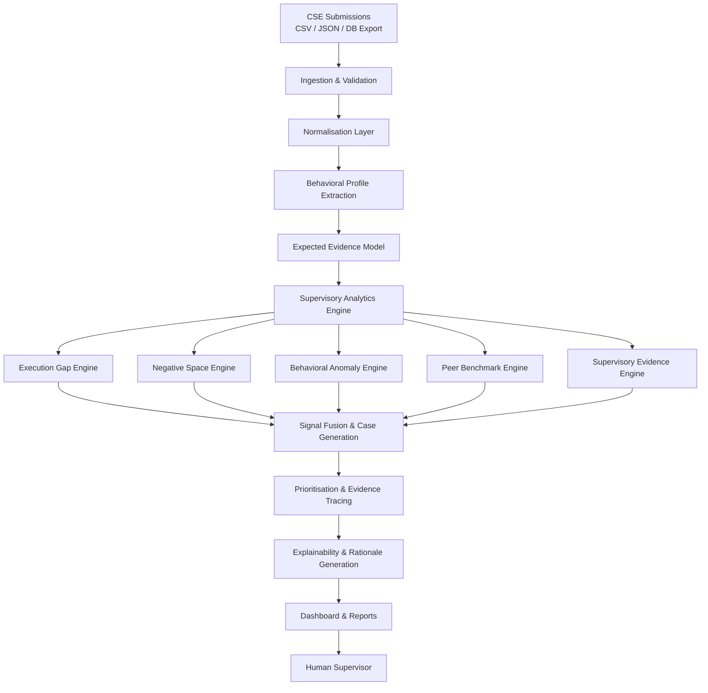

# SAT-SA

**Supervisory Analytics Tool for SOC Assessment**

Smart India Hackathon 2026 · Problem Statement SIH26157 · NCIIPC

> Evidence-driven supervisory insight at portfolio scale.

---

## 1. Executive Overview

The National Critical Information Infrastructure Protection Centre (NCIIPC) assesses the cyber resilience of Critical Sector Entities (CSEs) by manually reviewing samples of security alerts and case-management records produced by Security Operations Centres (SOCs). This manual review is one of NCIIPC's most valuable supervisory mechanisms: it consistently surfaces operational weaknesses that policies, audits, self-assessments, KPI dashboards, and compliance documentation do not reveal.

Manual review, however, does not scale. As the number of CSEs grows and security data volumes increase, supervisors cannot examine enough evidence to maintain coverage. **SAT-SA** is designed to address this gap by analysing SOC alert and case-management data across multiple entities, identifying indicators that warrant human examination, and presenting findings with supporting evidence and rationale. It is a **supervisory analytics capability**, not an operational security tool.

SAT-SA answers a different question than a SOC or SIEM:

| Role | Core Question |
|------|--------------|
| SOC / SIEM | "Is there a cyber attack?" |
| **SAT-SA** | "**Is the SOC operating effectively, and where should a supervisor look next?**" |

SAT-SA does not generate alerts, block threats, or respond to incidents. It transforms operational evidence into **signals → evidence → priorities → human supervisory decisions**.

---

## 2. Problem

NCIIPC's manual supervisory reviews have repeatedly revealed that reported SOC capabilities and actual operational behaviour can diverge significantly. These divergences matter because they indicate weaknesses in detection, investigation, escalation, incident response, governance, and operational discipline that would otherwise go undetected.

The core supervisory problem has two dimensions.

### Execution Gaps

Execution gaps occur when documentation, policies, metrics, or management reports suggest that controls are functioning well, but operational evidence shows otherwise. Supervisory signals include:

- Alerts acknowledged but not meaningfully investigated
- Cases closed unusually quickly, especially high-severity alerts
- Critical alerts closed without appropriate escalation
- Repetitive, template-driven investigations that lack depth
- Controls deployed but not effectively monitored
- Operational behaviour optimised for metrics rather than risk reduction
- Alert severity "critical" but closure rationale "benign"
- Investigation "completed" in implausibly short time
- Escalation decision recorded without investigation evidence

From a supervisory perspective, execution gaps are dangerous because they create an **illusion of maturity**. An entity may appear compliant while its SOC is not performing meaningful work.

### Negative Space

Negative space occurs where expected evidence is absent. Supervisory signals include:

- Missing telemetry from critical systems
- Absence of expected alert categories
- Missing investigations or escalation records
- Unexpectedly low activity levels relative to asset inventory or peer entities
- Monitoring blind spots
- No evidence of activities that would normally be expected in comparable environments
- Entire asset categories with no telemetry despite claimed monitoring
- Expected alert sources completely absent (e.g., no endpoint-based detections)

Negative space is particularly hard to detect through conventional reporting because **absence is invisible** until someone knows what to look for. SAT-SA is designed to surface these absences systematically by building **CSE-specific expected-evidence models** and comparing them against observed data.

### Why Conventional Tools Miss This

| Tool | What It Sees | What It Misses |
|------|-------------|----------------|
| KPI Dashboard | Response time, closure rate, escalation count | Investigation depth, escalation legitimacy, trend degradation |
| SIEM | Alerts in real time | Whether the SOC actually understands them or just closes them |
| Audit/Compliance | Policy conformance | Actual execution vs. documented processes |
| Manual Review (current) | Deep insight from samples | Cannot scale to portfolio-wide supervision |
| **SAT-SA (if done well)** | **Behavioral patterns, evidence chains, absence, divergence** | **Should catch all of the above at scale** |

---

## 3. Our Solution

SAT-SA is a supervisory intelligence and analytics platform. It ingests periodic, structured submissions from CSEs, normalises the data, applies supervisory analytics, and presents evidence-backed findings to human examiners.

### The Core Innovation

Most supervisory tools ask: "What happened?" (descriptive).

SAT-SA asks:
- "What *should* have happened?" (prescriptive)
- "Where is the gap?" (diagnostic)
- "Is the gap systemic or incidental?" (analytical)
- "What should the examiner investigate first?" (prioritization)

This requires **five integrated engines**:

1. **Execution Gap Engine** — "Claimed process ≠ observed behavior"
2. **Negative Space Engine** — "Expected evidence ≠ observed evidence"
3. **Behavioral Anomaly Engine** — "Observed behavior ≠ normal behavior"
4. **Peer Benchmark Engine** — "Entity behavior ≠ comparable entities"
5. **Supervisory Evidence Engine** — "Finding → rationale → evidence → sample"

At the heart of these engines is the **Expected Evidence Model**: for each CSE, predict "normal" evidence based on claims + history + asset inventory, then compare actual evidence against the model. This is what makes negative-space detection possible.

### The End-to-End Flow

```
CSE Data (alerts, cases, investigations, escalations, asset inventory)
    ↓
Data Ingestion & Validation
    ↓
Normalisation & Behavioral Profile Extraction
    ↓
Expected Evidence Model (CSE-specific "what should be observed")
    ↓
Supervisory Analytics Layer (5 Engines)
├── Execution Gap Engine
├── Negative Space Engine
├── Behavioral Anomaly Engine
├── Peer Benchmark Engine
└── Supervisory Evidence Engine
    ↓
Signal Fusion & Supervisory Case Generation
    ↓
Prioritization & Evidence Tracing
    ↓
Explainability & Rationale Generation
    ↓
Finding & Evidence Engine
    ↓
Manual-Review Prioritisation
    ↓
Dashboard / Supervisory Reports
    ↓
Human Supervisor (final decision)
```

SAT-SA does not make compliance determinations or supervisory conclusions. It produces **findings** — structured observations with rationale, supporting evidence, and recommended review actions. The examiner decides what each finding means and what follow-up is warranted.

---

## 3a. The Expected Evidence Model

Negative-space detection requires a baseline: **what should this CSE be producing?**

SAT-SA builds a CSE-specific **Expected Evidence Model** that predicts what evidence *should* be observed based on:

- The CSE's claimed capabilities and monitoring scope
- Its asset inventory (criticality, category, environment)
- Historical baselines from previous submission periods
- Peer entity behavior in comparable environments

For any given situation, the model defines:

```text
Expected Evidence
       ↓
Observed Evidence
       ↓
Evidence Gap
```

**Example: Critical Alert**

Expected:
- Investigation opened within SLA
- Analyst assigned
- Evidence collected (logs, artifacts)
- Escalation decision recorded
- Closure reason documented
- Root cause identified (if applicable)

Observed:
- Investigation opened ✓
- Analyst assigned ✓
- Evidence collected ✗
- Escalation decision ✗
- Closure reason ✓
- Root cause identified ✗

→ **Evidence Gap: Missing escalation decision, missing root cause**

This model makes negative-space detection systematic rather than relying on examiners to notice absences manually.

The Expected Evidence Model is what makes SAT-SA different from a generic anomaly detector. Anomaly detectors flag what is present. SAT-SA flags what is missing — and whether that absence is suspicious.

---

## 4. What SAT-SA Does

The table below describes the capabilities of SAT-SA. Items marked **Planned** are part of the intended design; items marked **Implemented** are present in the current prototype.

| Capability | Description | Supervisory Value | Status |
|------------|-------------|------------------|--------|
| Multi-CSE Data Ingestion | Accept structured submissions from multiple CSEs in common formats | Enables portfolio-wide supervision | Planned |
| Data Normalisation | Map heterogeneous CSE data into a common analytical schema | Allows consistent analytics across entities | Planned |
| Execution Gap Detection | Identify patterns where operational evidence contradicts reported capability | Surfaces hidden control weaknesses | Planned |
| Negative Space Detection | Flag missing expected evidence (telemetry, alerts, investigations, escalations) | Reveals monitoring blind spots and absent processes | Planned |
| Anomaly Detection | Detect outliers in closure velocity, workload, repetition, and peer behaviour | Highlights unusual operational patterns | Planned |
| Peer Benchmarking | Compare entities against normalised peer baselines and percentiles | Identifies significant deviations | Planned |
| Supervisory Attention Score | Rank entities by aggregated supervisory risk indicators | Directs limited review resources to highest-priority entities | Planned |
| Alert & Sample Prioritisation | Rank individual alerts, cases, and investigation samples for manual review | Improves efficiency of manual sampling | Planned |
| Evidence Tracing | Record which source records contributed to each finding | Enables examiner validation and audit | Planned |
| Explainability | Provide rationale, contributing factors, and record-level evidence for every finding | Supports traceability and supervisory judgement | Planned |
| Trend Analysis | Track indicators across submission periods | Shows whether conditions are improving or degrading | Planned |
| Supervisory Dashboards & Reports | Generate portfolio, entity, and finding-level views with drill-down | Supports briefing, review, and documentation | Planned |

---

## 5. What SAT-SA Is — And What It Is Not

SAT-SA is intentionally bounded. Understanding the boundary is essential.

### SAT-SA Is NOT a SOC

A SOC performs real-time monitoring, alert detection, incident response, threat hunting, containment, blocking, and log monitoring.

SAT-SA does none of these.

### SAT-SA Is NOT a SIEM

A SIEM ingests millions of raw logs and continuously correlates them to detect attacks.

SAT-SA does not do this. It does not ingest raw packet captures. It does not run live detection rules. It does not generate security alerts.

### SAT-SA Is NOT a National Monitoring System

NCIIPC is not asking: "Give us live visibility into every CSE."

No. NCIIPC already has SOCs. They want a **supervisory intelligence layer** that looks at evidence produced by SOCs and tells examiners where the SOC may have weaknesses.

### SAT-SA IS Supervisory Analytics

SAT-SA asks:

> **"Based on the operational evidence submitted by this CSE, does its security operation appear effective?"**

It transforms SOC data into **signals → evidence → priorities → human supervisory decisions**.

| Role | Core Question |
|------|--------------|
| SOC / SIEM | "Is there a cyber attack?" |
| **SAT-SA** | "**Is the SOC operating effectively, and where should a supervisor look next?**" |

### Out-of-Scope Capabilities

The following are explicitly **out of scope** and will not be added:

- Real-time SOC monitoring or alerting
- SIEM correlation or live event processing
- Network packet capture or analysis
- Customer data or PII processing
- Cloud deployment or SaaS features
- External API integrations
- Generic chatbot or LLM wrapper
- Compliance scoring or certification

This boundary is directly aligned with SIH26157 and preserves the role of human examiners as the ultimate authority.

---

## 6. Architecture

The architecture is modular, offline-capable, and built around the supervisory analytics pipeline.



### Design Principles

- **Offline-first:** All processing occurs locally; no external network calls.
- **Deterministic core:** Analytics are primarily rule-based and statistical, ensuring reproducibility and auditability.
- **Explainability by construction:** Every finding carries the records, rules, and thresholds that produced it.
- **Evidence-integrity first:** Analytics focus on workflow integrity, expected-evidence gaps, and behavioral drift — not generic anomaly scoring.
- **Extensible:** New supervisory signals can be added as analytics modules without altering the core pipeline.

---

## 7. Supervisory Analytics Engine

The analytics engine is the technical core of SAT-SA. It is organised into **8 detection modules** across **5 engines**, mapped to the **8 supervisory capability areas**.

### Capability Area → Signal Group Mapping

| Capability Area | Signal Groups |
|----------------|---------------|
| Threat Detection | Alert volume gaps, missing alert categories, alert source distribution |
| Investigation | Execution gap (superficial closures), investigation quality heuristics, evidence artifact absence |
| Escalation | Execution gap (escalation without action), escalation absence, escalation pattern anomalies |
| Incident Response | Repetition patterns, recurring incidents, root-cause absence, case reopenings |
| Security Operations | Workload distribution, queue accumulation, analyst concentration |
| Governance & Oversight | KPI-reality divergence, workflow integrity, exception documentation |
| Operational Discipline | Temporal implausibility, missing fields, workflow breaks, premature closures |
| Cyber Resilience | Temporal drift, cyclical anomalies, recurring failures, blind-spot persistence |

### 7.1 Evidence Chain Integrity Engine

Models each alert/case as a workflow with expected state transitions and artifacts. Detects broken workflows that dashboards miss.

| Signal | Detection Method | Supervisory Interpretation |
|--------|-----------------|---------------------------|
| Missing transitions | Workflow state machine validation | Critical alert → no investigation → direct closure (broken chain) |
| Contradictory evidence | Severity vs. closure rationale comparison | Alert severity "critical" but closure "benign" without investigation |
| Temporal implausibility | Duration vs. severity distribution | Investigation "completed" in 2 minutes for a critical alert |
| Incomplete chain | Required artifact presence check | Investigation documented but no escalation decision recorded |
| Evidence absence | Dependency check | Escalation decision without investigation evidence |
| Premature closure | Post-incident review period check | Closure before expected post-incident review period |

### 7.2 Expected-Evidence Model

Builds a CSE-specific model of what evidence *should* be observed based on claims, asset inventory, and historical patterns.

| Signal | Detection Method | Supervisory Interpretation |
|--------|-----------------|---------------------------|
| Alert volume gap | Expected vs. observed volume (Bayesian comparison) | If 0 alerts despite claimed monitoring, monitoring is likely dead |
| Missing alert categories | Inventory-to-alert mapping | If EDR deployed but no process-injection alerts, detection gap |
| Alert source distribution | Asset-to-source correlation | All alerts from network segment A; nothing from B, C, D |
| Investigation ratio gap | Expected vs. observed investigation rate | High-severity alerts with no investigation record |
| Evidence artifact absence | Claimed capability vs. documented artifacts | Escalation without threat-intel lookup or config review |

### 7.3 Investigation Quality Heuristics

Detects shallow vs. quality investigation through measurable signals.

**Markers of Shallow Investigation:**
- Investigation notes are generic/templated ("Checked logs, found nothing")
- Time invested is implausibly short for alert complexity
- No attempt to determine root cause (just closed alert)
- No supporting evidence documented
- Same template used for different alert types
- No timestamp gaps between investigation open and close (single session, no real work)

**Detection Approach:**
- **Text analysis:** NLP to classify investigation notes as templated vs. contextual
- **Temporal analysis:** Investigation duration vs. alert complexity (mismatch = red flag)
- **Evidence audit:** Presence/absence of specific evidence types
- **Consistency check:** Identical investigations closed identically (copy-paste?)

### 7.4 Temporal Drift & Behavioral Change Detection

Uses time-series analysis and change-point detection to identify when and how SOC operational behavior changes.

**Measurable Behavioral Dimensions:**
1. Investigation Depth: Average investigator effort per alert
2. Closure Velocity: Time from alert to closure (median, variance, by severity)
3. Escalation Propensity: % of alerts escalated
4. Alert Volume Trend: Alerts per day over time (sudden drops are suspicious)
5. Investigation Quality Trend: Evidence entries per investigation (declining trend is suspicious)
6. Repetition Pattern: Identical investigations recur with same resolution
7. Workload Distribution: Concentration of work among staff
8. Responsiveness: Mean time to first action on alert

**Novel Analysis:**
- **Change-point detection:** Statistical methods (CUSUM, Bayesian change-point) to identify when SOC behavior shifts
- **Drift detection:** Gradual degradation vs. abrupt change (different underlying causes)
- **Anomalous consistency:** Behavior that is suspiciously *stable* (e.g., every critical alert closed in exactly 4 hours)
- **Seasonality removal:** Distinguish legitimate variance from concerning drift

### 7.5 KPI-vs-Operational-Reality Divergence

Compares reported metrics (SLA compliance, closure rates, escalation counts) against operational quality indicators.

**Divergence Patterns:**

| Reported Metric | Operational Signal | Interpretation |
|----------------|-------------------|----------------|
| Alert Response SLA: 99% ✓ | Investigation depth ↓ | SLA gaming |
| Closure Rate: 95% ✓ | Evidence quality ↓ | Superficial closures |
| Mean Closure Time: 6h ✓ | Investigation completeness ↓ | Speed over thoroughness |
| Escalation Count: +20% ✓ | Post-escalation follow-up ↓ | Escalation without action |

**Detection Approach:** Build a correlation matrix between reported KPIs and operational quality indicators. If SLA compliance improves but investigation depth declines → potential gaming.

### 7.6 Metric Gaming Detection

This is one of the most important supervisory signals SAT-SA can detect. When a SOC is measured by specific KPIs, analysts may optimize for the metric rather than for actual security effectiveness.

**The Pattern:**

```text
KPI Target Introduced
       ↓
Before: Median investigation = 42 min
After:  Median investigation = 4 min

But:

Investigation evidence ↓
Root-cause documentation ↓
Escalation ↓
Reopened cases ↑
```

The organization is technically meeting the KPI. But operational effectiveness is getting worse.

**Detection Signals:**

| Reported Metric | Operational Signal | Interpretation |
|----------------|-------------------|----------------|
| Alert Response SLA: 99% ✓ | Investigation depth ↓ | SLA gaming |
| Closure Rate: 95% ✓ | Evidence quality ↓ | Superficial closures |
| Mean Closure Time: 6h ✓ | Investigation completeness ↓ | Speed over thoroughness |
| Escalation Count: +20% ✓ | Post-escalation follow-up ↓ | Escalation without action |

**Detection Approach:**
- Track metric trends alongside operational quality trends
- Flag divergence: metric improves while quality degrades
- Correlate with workload, staffing, and process changes
- Identify "suspiciously perfect" KPI compliance (e.g., every critical alert closed in exactly 4 minutes)

SAT-SA asks: **"Is the SOC optimizing for measurement, or for security?"**

### 7.7 Peer Benchmarking with Smart Grouping

Contextualises entity metrics against comparable CSEs with normalization to avoid misleading comparisons.

**NOT:** "CSE-042 closes alerts 10x faster than CSE-017" (entities are different; meaningless)

**INSTEAD:** "CSE-042's closure velocity is 3σ below peer group after controlling for alert mix, asset count, and staffing."

**Normalization Factors:**
- Alert severity distribution (high-risk group may naturally close faster)
- Asset inventory complexity (large, complex environments need deeper investigation)
- Sector norms (financial services vs. utilities vs. telecom have different baselines)
- Claimed detection capabilities (more mature SOCs may handle more alerts)
- Historical stability (stable entities vs. new/changing SOCs)

**Finding Types:**
- **Consistent outlier:** Always in top/bottom 5% → structural difference
- **Recent outlier:** Recently diverged from peers → possible incident or staffing change
- **Unexplained similarity:** Multiple CSEs exhibit nearly identical suspicious behavior → possible shared weakness
- **Healthy outlier:** Deviates from peers but for defensible reasons

### 7.8 Cyclical & Temporal Anomalies

Detects patterns in SOC operations that deviate from expected temporal behavior.

**Anomalies to Detect:**
1. Unexpected quiet periods: No alerts during peak threat hours
2. After-hours absence: Critical system activity not investigated outside business hours
3. Weekend gaps: Missing escalations on weekends (on-call failure?)
4. Periodic bulk closures: Mass closures every Friday (clearing backlog vs. legitimate patterns)
5. Shift-based quality variance: Investigations by night shift much shallower than day shift
6. Staffing-correlated gaps: Alerts increase when staff on leave; investigations decrease

### 7.9 Supervisory Attention Score

The Supervisory Attention Score aggregates detected signals into an entity-level indicator that helps prioritise manual review.

**What contributes:**

- Number and severity of execution-gap findings
- Number and severity of negative-space findings
- Anomaly severity and persistence across periods
- Peer-deviation magnitude
- Evidence completeness and confidence
- Signal diversity (multiple signal types increase confidence)

**How it is calculated:**

The score is a weighted aggregation of normalised signal strengths. Weights prioritize:
- Signal confidence (0.4)
- Signal severity (0.3)
- Signal count and diversity (0.3)

Exact weights and thresholds are configurable and documented in the analytics module configuration. The score is **not** a security posture rating, compliance score, or cyber risk index. It is a prioritisation tool: it answers "where should a supervisor look first?"

---

## 8. Explainability and Evidence

Explainability is a first-class requirement of SAT-SA, not an afterthought.

### What Makes a Finding Explainable

For every finding, the system records and presents:

1. **What was detected** — the signal type (execution gap, negative space, anomaly, peer deviation)
2. **Why it was detected** — the rule, threshold, statistical test, or model that triggered the finding
3. **What evidence supports it** — specific alert IDs, case records, timestamps, and field values
4. **Which records contributed** — a traceable list of source records with identifiers
5. **How unusual it is** — entity-specific and peer-relative context (percentile, deviation magnitude, baseline comparison)
6. **What the supervisor should review** — recommended records, time ranges, and analytical views
7. **Strength of the signal** — confidence or severity indicator based on evidence quality and consistency
8. **Caveats and alternative explanations** — What could cause false positives? What else might explain this?

### Why Rationale ≠ Causation

SAT-SA explicitly distinguishes:
- **Rationale:** Why the system flagged this (the detection logic)
- **Causation:** Why the condition exists (requires examiner judgment)

The system provides the rationale. The examiner determines causation and appropriate follow-up.

This structure ensures that:
- Examiners can validate findings independently.
- Results are auditable across submission cycles.
- Supervisory decisions can be documented with explicit rationale.
- The system's behaviour is reproducible and inspectable.

---

## 9. Example Supervisory Finding

The following is a realistic, end-to-end finding produced by SAT-SA.

---

**Entity:** CSE-042  
**Finding Type:** Investigation effectiveness degradation  
**Signal Category:** Execution Gap + Behavioral Drift + Peer Outlier  

**Summary:**  
CSE-042's investigation depth declined 70% over four quarters while alert volume remained constant. Median investigation depth fell from 7.2 evidence entries per alert (Q1) to 2.1 entries (Q4). A statistical change point was detected in Q3. Closure velocity improved concurrently. Peer comparison shows CSE-042 is now at the 5th percentile for investigation depth among 8 telecom-sector SOCs of similar size and claimed capabilities.

**Evidence:**

| Quarter | Avg Evidence Entries | Median Closure Time | Peer Percentile |
|---------|---------------------|---------------------|-----------------|
| Q1 2024 | 7.2 | 4.2 hours | 45th |
| Q2 2024 | 6.8 | 3.8 hours | 42nd |
| Q3 2024 | 3.1 | 2.5 hours | 12th ← Change point |
| Q4 2024 | 2.1 | 1.8 hours | 5th |

**Temporal Analysis:**  
Change-point detection algorithm (PELT with penalty=BIC) identifies Q3 2024 as structural break. Before: mean=7.0, stdev=0.8. After: mean=2.6, stdev=0.5. Decline is statistically significant (t-test, p<0.001).

**Peer Comparison:**  
CSE-042 is in a peer group of 8 telecom-sector SOCs (±20% asset size, same claimed detection capabilities). Peer median investigation depth: 6.1 entries. CSE-042: 2.1 entries (z-score: -3.2).

**Possible Causes (for examiner to assess):**
1. Staff turnover or reduced staffing
2. Increased alert volume without corresponding resource increase
3. Process shortcuts introduced without oversight
4. Change in investigation quality standards
5. Data reporting gap (investigations happening but not documented)

**Recommended Action:**  
Prioritise investigation and staffing records for CSE-042 for manual review. Examiner should verify: (a) Whether depth decline corresponds to staffing/workload changes. (b) Whether investigation shortcuts create actual risk. (c) Whether escalation process still appropriately routes cases.

**Confidence:** High (consistent signal across multiple dimensions; statistical significance confirmed; peer deviation confirmed)

**Caveats:**  
- Alert volume remained stable; no workload increase explains the decline
- Peer comparison assumes comparable alert severity mix
- Change-point detection requires at least 4 data points; earlier periods unavailable

---

This finding does not conclude that CSE-042 is non-compliant. It states that **potential supervisory concern exists and human examination is warranted.**

---

## 9a. The Supervisory Finding Card

Every SAT-SA finding is presented as a **Finding Card** — a structured, human-readable summary designed for NCIIPC examiners.

```
━━━━━━━━━━━━━━━━━━━━━━━━━━━━━━━━━━━━━━━━━━
🔴 Potential Execution Gap

CSE:            CSE-014
Domain:         Investigation
Priority:       HIGH
Confidence:     93%

Signal
Critical alerts are frequently closed
without sufficient investigation evidence.

Evidence
• 1,238 critical alerts
• 61% closed < 5 minutes
• Peer median = 14 minutes
• 74% use identical investigation sequence
• Root-cause evidence missing in 68%

Affected Cases
237

Recommended Action
Review 20 high-information cases.

[VIEW EVIDENCE]
━━━━━━━━━━━━━━━━━━━━━━━━━━━━━━━━━━━━━━━━━━
```

**Every Finding Card includes:**

| Field | Purpose |
|-------|---------|
| Finding Type | Execution Gap, Negative Space, Anomaly, Peer Deviation |
| CSE & Domain | Which entity and capability area |
| Priority | HIGH / MEDIUM / LOW |
| Confidence | How strong the signal is |
| Signal Description | What was detected |
| Evidence Summary | Quantitative backing |
| Affected Cases | How many records contributed |
| Recommended Action | What examiner should do next |
| Caveats | Alternative explanations |

The Finding Card is the primary output of SAT-SA. It is designed to be read in under 30 seconds and to trace directly to deeper evidence.

---

## 9b. The Evidence Graph

Every finding traces back to source records through an **Evidence Graph** — a traceable chain linking findings to the raw submitted data.

```
Finding
   ↓
Signal
   ↓
Metric
   ↓
Cases
   ↓
Alerts
   ↓
Submitted dataset
```

**Example trace:**

```
Finding: Potential Escalation Gap

      ↓

Signal: Critical alerts have unusually low escalation

      ↓

Metric: Escalation rate = 1.4%

      ↓

Evidence: 37 critical cases

      ↓

Alert IDs:
AL-234
AL-291
AL-301
...
```

The Evidence Graph makes SAT-SA fully auditable. An examiner (or auditor) can reconstruct:

```text
Dataset version
        ↓
Analytics version
        ↓
Rules/models used
        ↓
Features calculated
        ↓
Finding generated
        ↓
Score calculated
```

This traceability is essential for supervisory decisions.

---

## 9c. Eight Capability Areas

SAT-SA's analytics are organized around **eight capability areas** that map directly to NCIIPC's supervisory assessment framework.

### 1. Threat Detection

Questions:
- Are expected alert types appearing?
- Are critical assets generating telemetry?
- Are detection patterns unusual?
- Are some categories absent?

### 2. Investigation

Questions:
- Are alerts actually investigated?
- How long do investigations take?
- Is evidence recorded?
- Are investigation steps meaningful?
- Are investigation patterns repetitive?

### 3. Escalation

Questions:
- Are critical alerts escalated?
- Are escalation times reasonable?
- Are escalation patterns consistent?
- Are important alerts being closed without escalation?

### 4. Incident Response

Questions:
- Are incidents repeatedly recurring?
- Is remediation happening?
- Are root causes identified?
- Are cases reopened?

### 5. Security Operations

Questions:
- Are workloads plausible?
- Are analyst workloads unusual?
- Are alerts distributed strangely?
- Are queues accumulating?

### 6. Governance & Oversight

Questions:
- Are processes being followed?
- Are records complete?
- Are exceptions documented?
- Are management controls reflected in actual operations?

### 7. Operational Discipline

Questions:
- Are mandatory fields populated?
- Are timestamps sensible?
- Are workflows followed?
- Are cases being prematurely closed?

### 8. Cyber Resilience

Questions:
- Do problems keep recurring?
- Are root causes fixed?
- Are blind spots persistent?
- Does operational effectiveness deteriorate over time?

Each capability area feeds into the five supervisory analytics engines. The eight areas provide the supervisory vocabulary; the five engines provide the analytical mechanism.

---

## 9d. Anomaly Detection for Unknown Indicators

The problem statement explicitly requires:

> "The tool should help supervisors identify both known and previously unknown indicators."

SAT-SA therefore goes beyond predefined rules. While deterministic rules catch known patterns, unsupervised and statistical techniques discover previously unknown indicators.

### Techniques Used

| Technique | Purpose | Example |
|-----------|---------|---------|
| **Isolation Forest** | Multivariate outlier detection | Entity with unusual combination of metrics |
| **Clustering** | Group similar entities/patterns | Discover hidden peer groups or operational archetypes |
| **Change-point detection** | Detect sudden behavioral shifts | SOC behavior changed in Q3 but no rule caught it |
| **Statistical deviation** | Identify significant peer differences | Entity at 99th percentile for some metric |
| **Sequence analysis** | Detect repetitive workflows | Same investigation sequence repeated 200 times |
| **Graph analytics** | Discover entity relationships | Asset-alert-case escalation patterns |

### How Unknown Indicators Surface

```text
Entity A: Critical alerts → 7%
Entity B: Critical alerts → 8%
Entity C: Critical alerts → 0.02%
```

Entity C deviates significantly. The deterministic rules might not flag it (0.02% is not "zero"). But anomaly detection surfaces it as a potential supervisory concern.

### The Safety Guardrail

Anomaly detection is **augmentation, not replacement** for deterministic rules:

1. **Anomaly detection** surfaces candidates
2. **Deterministic rules** validate candidates against known patterns
3. **Signal fusion** combines both into supervisory cases
4. **Examiners** make the final judgment

No finding is based solely on an anomaly score. Every anomaly finding must be explainable and traceable.

---

## 10. Dashboard

The dashboard is designed for NCIIPC supervisors and examiners. It is a decision-support surface, not an operational SOC-style visualisation.

**Conceptual views:**

- **Portfolio Overview:** Entity-level Supervisory Attention Scores, trend arrows, and count of open findings across the CSE portfolio.
- **CSE Attention Ranking:** Ordered list of entities by priority, with score breakdown and top contributing signals.
- **Execution Gap Findings:** Filterable list of execution-gap findings with severity, entity, and evidence summary.
- **Negative Space Findings:** Filterable list of missing-evidence findings with affected asset categories and alert types.
- **Peer Comparison View:** Entity metrics against peer group distributions, with deviation highlighting.
- **Manual Review Queue:** Prioritised list of alerts, cases, and investigation samples recommended for examiner review.
- **Finding Detail & Evidence Drill-Down:** For any finding, drill into contributing records, source data, and detection rationale.
- **Trend Analysis:** Time-series views of entity scores, finding counts, and metric distributions across submission periods.
- **Signal Fusion View:** Shows how multiple weak signals combine into high-confidence supervisory cases.

The dashboard emphasises **traceability, context, and actionability** over visual flair.

---

## 11. Data Model

SAT-SA works with structured, periodic submissions from CSEs. Raw packet captures, customer information, and other sensitive operational logs are not required.

### Expected Inputs

| Data Domain | Description | Required |
|-------------|-------------|----------|
| Alert metadata | Alert ID, timestamp, severity, category, asset ID, status, closure timestamp | Yes |
| Case management records | Case ID, linked alert IDs, owner, status, timestamps | Yes |
| Investigation workflow data | Investigation ID, linked case/alert ID, steps, notes, attachments, timestamps | Yes |
| Escalation records | Escalation ID, linked alert/case ID, escalation level, timestamp, recipient | Yes |
| Alert disposition & closure | Closure reason, closure method, re-open count | Yes |
| Asset & system inventory | Asset ID, criticality, category, owner, environment | Recommended |

### Standard Fields

```python
# Alert
alert_id, timestamp, source, severity, category, description, asset_id, status, closure_timestamp

# Investigation
investigation_id, alert_id, timestamp_open, timestamp_close, evidence_entries, assigned_to, depth_score

# Escalation
escalation_id, investigation_id, timestamp, decision, rationale, recipient

# Case
case_id, related_alerts, case_type, severity, closure_time, resolution

# Inventory
asset_id, asset_type, criticality, monitoring_status
```

### Supported Formats

- CSV
- JSON
- Database exports (tabular)
- API submissions (where CSE infrastructure permits)

The ingestion layer validates submissions against a schema and records data quality issues for examiner awareness.

---

## 12. Offline / Air-Gapped Deployment

SAT-SA is designed for deployment within an NCIIPC-controlled, air-gapped environment.

**Deployment constraints satisfied:**

- Fully offline operation — no Internet connectivity required at runtime.
- No cloud services dependency.
- No SaaS platform dependency.
- No externally hosted AI model or API dependency.
- Local data processing only.
- Local deployment on NCIIPC infrastructure.

**AI/ML posture (if applicable):**

Where statistical or machine learning techniques are used, they operate entirely locally:

- Model architecture documented and inspectable.
- Hardware requirements specified for on-premises deployment.
- Offline training and inference approach.
- Model update mechanism via NCIIPC-controlled channels only.
- Explainability controls integrated into the analytics pipeline.
- Auditability controls ensuring model behaviour is reproducible and logged.

No runtime calls are made to external services, APIs, or cloud endpoints.

---

## 13. AI/ML Strategy

SAT-SA employs a **hybrid deterministic-first** analytics strategy.

### Deterministic Analytics (Primary)

- Rule-based execution-gap and negative-space detection
- Statistical thresholding and outlier detection
- Peer benchmarking and percentile computation
- Completeness checks and coverage gap analysis
- Workflow integrity validation (state machine)
- Expected-evidence gap quantification

Deterministic methods are preferred because they are auditable, reproducible, and explainable by design.

### Statistical / ML Augmentation (Where Justified)

- Anomaly detection on multivariate operational patterns (Isolation Forest, LOF)
- Repetition and similarity scoring for investigation notes (NLP text classification)
- Temporal trend change-point detection (CUSUM, PELT algorithm)
- Unsupervised clustering of CSEs to discover hidden patterns (k-means, DBSCAN)
- KPI-reality divergence correlation analysis

ML components, if used, are:

- Trained and validated on NCIIPC-provided or synthetic data.
- Documented with architecture, training data, and performance characteristics.
- Evaluated for explainability and false-positive implications.
- Run locally with no external dependencies.

AI is not used for marketing purposes. It is used only where it provides measurable analytical value beyond deterministic methods.

### Where Is the AI?

AI is not the center of SAT-SA. The system uses:

1. **Deterministic logic** for workflow integrity analysis and evidence tracing
2. **Statistical methods** for change-point detection, anomaly identification, and peer comparison
3. **Optional local ML** for text classification of investigation notes, unsupervised clustering of CSEs, and time-series forecasting

All ML is **offline, local, explainable, and optional**. No external APIs or cloud dependencies. No generic ChatGPT wrappers. Every ML component has a clear supervisory purpose and explainability mechanism.

---

## 14. Novel Supervisory Signals

SAT-SA implements 8 signal groups beyond conventional anomaly detection. These are the signals that make SAT-SA genuinely different from a generic dashboard.

### Signal Group 1: Evidence Chain Integrity

Models SOC operations as workflows with expected state transitions. Detects:
- Missing transitions (critical alert → no investigation → direct closure)
- Contradictory evidence (alert severity "critical" but closure rationale "benign")
- Temporal implausibility (alert→closure in 2 minutes for critical event)
- Incomplete chains (investigation without escalation decision)
- Premature closure (closure before post-incident review period)

### Signal Group 2: Expected-Evidence Presence

For each CSE, builds an expected-evidence model based on asset inventory, claimed capabilities, and historical baselines. Detects:
- Alert volume gaps (expected vs. observed)
- Missing alert categories (EDR deployed but no endpoint alerts)
- Investigation ratio gaps (high-severity alerts with no investigation)
- Evidence artifact absence (escalation without threat-intel lookup)

### Signal Group 3: Behavioral Drift & Change Points

Uses change-point detection (CUSUM, PELT) to identify when SOC behavior shifts:
- Investigation depth degradation over time
- Closure velocity changes
- Escalation propensity shifts
- Alert volume anomalies
- Investigation quality trends

### Signal Group 4: KPI-vs-Operational-Reality Divergence

Compares reported metrics against operational quality:
- If SLA compliance improves but investigation depth declines → potential gaming
- If closure rate improves but evidence quality decreases → superficial closures
- If escalation count increases but remediation evidence decreases → no follow-through

### Signal Group 5: Peer Relative Behavior (Smart Peer Grouping)

Normalized peer analytics that avoid false positives:
- Controls for alert mix, asset count, staffing, sector norms
- Identifies consistent outliers, recent outliers, unexplained similarities
- Distinguishes healthy outliers from concerning deviations

### Signal Group 6: Cyclical & Temporal Anomalies

Detects temporal patterns that signal problems:
- Unexpected quiet periods during peak threat hours
- After-hours absence for critical systems
- Weekend gaps in escalations
- Periodic bulk closures (Friday backlog clearing)
- Shift-based quality variance

### Signal Group 7: Negative Space Specificity

Seven types of absence detection:
1. Telemetry absence (expected log sources missing)
2. Alert absence (expected alert categories absent)
3. Investigation absence (high-severity alerts with no investigation record)
4. Escalation absence (alerts meeting criteria but not escalated)
5. Response absence (escalations with no documented response)
6. Trend absence (expected time-series patterns missing)
7. Evidence absence (investigation closed but key artifacts not mentioned)

### Signal Group 8: Investigation Quality Heuristics

Detects shallow investigation through:
- Templated vs. contextual investigation notes (NLP)
- Temporal implausibility (duration vs. complexity mismatch)
- Evidence audit (presence/absence of specific evidence types)
- Consistency checks (identical investigations closed identically)

---

## 15. Signal Fusion & Supervisory Case Generation

Individual signals are often weak. SAT-SA fuses multiple corroborating signals into higher-confidence **supervisory cases**.

### How Signal Fusion Works

```
Signal 1: Closure velocity ↓ by 30%  (Confidence: 60%)
Signal 2: Investigation depth ↓ by 40% (Confidence: 55%)
Signal 3: Escalation count ↓ by 50% (Confidence: 50%)
Signal 4: Peer deviation: 2.5σ (Confidence: 70%)
Signal 5: Alert volume constant (Confidence: 90%)

Fusion: Multiple weak signals → Supervisory Case
       Combined confidence: 85% (higher than individual signals)
       Case: "Likely investigation effectiveness degradation"
       Recommended review: Sample recent investigations for depth audit
```

### Signal Fusion Principles

1. **Correlation, not independence:** Signals are grouped if they likely indicate the same underlying issue
2. **Confidence aggregation:** Combined confidence exceeds individual signal thresholds
3. **Diversity bonus:** Multiple signal types increase case credibility
4. **Actionability:** Cases must be actionable for examiners

### Supervisory Case Structure

Each case includes:
- Case ID and entity reference
- List of contributing signals
- Priority score (0.0-1.0)
- Combined confidence
- Severity classification
- Human-readable summary
- Collated evidence
- Recommended examiner actions
- Caveats and alternative explanations

---

## 16. Implementation Roadmap

### Module 1: Data Ingestion & Normalisation

```python
class SATSADataPipeline:
    """Ingest CSE submissions, normalize to unified schema, validate quality."""
    
    def ingest_cse_submission(self, cse_id, data_format, data_source):
        # Parse format (CSV, JSON, XLSX, database export)
        # Validate against schema
        # Transform to standard schema
        # Check for data quality issues
        # Return normalized dataset + validation report
```

### Module 2: Behavioral Profile Extraction

```python
class BehavioralProfiler:
    """Extract behavioral features from normalized CSE data."""
    
    def build_cse_profile(self, cse_id, period_data):
        profile = {
            'cse_id': cse_id,
            'period': period_data.date_range,
            'alert_volume': self._calc_alert_volume(period_data),
            'alert_severity_distribution': self._calc_severity_dist(period_data),
            'investigation_depth': self._calc_investigation_depth(period_data),
            'closure_velocity': self._calc_closure_velocity(period_data),
            'escalation_rate': self._calc_escalation_rate(period_data),
            'workflow_integrity': self._calc_workflow_integrity(period_data),
            'evidence_completeness': self._calc_evidence_completeness(period_data),
            'temporal_patterns': self._detect_temporal_patterns(period_data),
            'quality_trend': self._calc_quality_trend(period_data),
        }
        return profile
```

### Module 3: Expected Evidence Model

```python
class ExpectedEvidenceModel:
    """Build CSE-specific expected model, compare observed vs expected."""
    
    def build_expected_model(self, cse_id, cse_claims, asset_inventory, historical_data):
        model = {
            'expected_alert_volume': self._estimate_alert_volume(...),
            'expected_alert_categories': self._estimate_alert_categories(...),
            'expected_investigation_ratio': self._estimate_investigation_ratio(...),
            'expected_escalation_rate': self._estimate_escalation_rate(...),
            'expected_evidence_artifacts': self._estimate_evidence_artifacts(...),
        }
        return model
    
    def compare_observed_vs_expected(self, observed_profile, expected_model):
        # Returns dict of gaps with severity, confidence, likely_cause
        pass
```

### Module 4: Execution Gap Engine

```python
class ExecutionGapEngine:
    """Detect patterns where claimed capabilities don't match operational evidence."""
    
    def detect_execution_gaps(self, cse_id, profile, expected_model, historical):
        findings = []
        findings.extend(self._detect_superficial_closures(profile))
        findings.extend(self._detect_escalation_without_action(profile))
        findings.extend(self._detect_quality_degradation(profile, historical))
        findings.extend(self._detect_template_investigations(profile))
        findings.extend(self._detect_severity_mismatch(profile))
        return findings
```

### Module 5: Negative Space Engine

```python
class NegativeSpaceEngine:
    """Detect missing evidence that should be present."""
    
    def detect_negative_space(self, cse_id, observed_profile, expected_model):
        findings = []
        gaps = self.compare_observed_vs_expected(observed_profile, expected_model)
        for gap_name, gap_data in gaps.items():
            severity = self._assess_gap_severity(gap_name, gap_data, cse_id)
            if severity and severity['confidence'] > 0.7:
                findings.append({...})
        return findings
```

### Module 6: Peer Benchmarking Engine

```python
class PeerBenchmarkingEngine:
    """Compare entity behavior against normalized peer baselines."""
    
    def build_peer_groups(self, all_cse_profiles, metadata):
        # Feature extraction for grouping
        # Clustering (k-means, DBSCAN, or hierarchical)
        # Label clusters by characteristics
        pass
    
    def benchmark_cse_vs_peers(self, cse_id, cse_profile, peer_group_profiles):
        # Normalized z-scores and percentiles
        # Deviation flags
        pass
```

### Module 7: Supervisory Case Engine

```python
class SupervisoryCaseEngine:
    """Fuse multiple weak signals into higher-confidence findings."""
    
    def generate_supervisory_cases(self, cse_id, execution_gaps, 
                                   negative_space_gaps, anomalies, peer_outliers):
        all_signals = execution_gaps + negative_space_gaps + anomalies + [peer_outliers]
        cases = self._cluster_signals_into_cases(all_signals)
        scored_cases = [self._score_case(case) for case in cases]
        scored_cases.sort(key=lambda c: c['priority_score'], reverse=True)
        return scored_cases
```

### Module 8: Explainability Engine

```python
class ExplainabilityEngine:
    """Provide clear rationale for every finding, trace evidence to source."""
    
    def generate_finding_explanation(self, finding):
        explanation = {
            'what_was_detected': self._describe_finding(finding),
            'why_detected': self._explain_detection_logic(finding),
            'evidence_records': self._trace_source_records(finding),
            'detection_method': self._describe_method(finding),
            'confidence': finding.get('confidence', 0.5),
            'caveats': self._list_caveats(finding),
            'alternative_explanations': self._list_alternatives(finding),
            'recommended_examiner_actions': self._recommend_actions(finding),
        }
        return explanation
```

---

## 17. Technology Stack

All components are open-source and suitable for air-gapped deployment.

| Layer | Technology | Purpose |
|-------|-----------|---------|
| **Frontend** | React or Vue.js | Dashboard, finding review, report generation |
| **Backend** | Python (FastAPI or Flask) | Ingestion, analytics orchestration, API |
| **Analytics** | Python / Pandas / NumPy / SciPy | Data processing, feature extraction, statistical analysis |
| **Database** | PostgreSQL + JSONB | Structured storage of submissions, findings, evidence |
| **ML/AI (optional)** | Scikit-learn | Anomaly detection, similarity scoring, clustering |
| **Deployment** | Docker / standalone Python | Offline packaging and local execution |
| **Testing** | Pytest | Unit tests, integration tests, validation harness |

Technologies are selected for offline compatibility, auditability, and minimal external dependencies.

---

## 18. Project Structure

```
SIH/
├── README.md
├── src/
│   ├── ingestion/          # Data ingestion, validation, normalisation
│   │   ├── pipeline.py
│   │   ├── schema.py
│   │   └── validators.py
│   ├── analytics/          # Supervisory analytics engines
│   │   ├── execution_gaps.py
│   │   ├── negative_space.py
│   │   ├── expected_evidence.py
│   │   ├── temporal_drift.py
│   │   ├── benchmarking.py
│   │   ├── kpi_divergence.py
│   │   ├── temporal_anomalies.py
│   │   ├── investigation_quality.py
│   │   ├── signal_fusion.py
│   │   └── scoring.py
│   ├── evidence/           # Finding construction and evidence tracing
│   │   ├── tracer.py
│   │   └── explainer.py
│   ├── api/                # Backend API
│   │   └── routes.py
│   └── dashboard/          # Frontend dashboard
│       ├── components/
│       └── views/
├── data/
│   ├── schemas/            # Ingestion schemas and validation rules
│   ├── samples/            # Sample CSE datasets for demonstration
│   └── config/             # Analytics thresholds, peer group definitions
├── tests/                  # Unit and integration tests
├── docs/                   # Additional documentation
├── requirements.txt        # Python dependencies
├── docker-compose.yml      # Deployment configuration
└── .env.example            # Configuration template
```

---

## 19. Installation

### Prerequisites

- Python 3.10+ (developed on 3.14; no Node.js, no build step)
- Storage: SQLite (file-based, zero administration)

### Setup

```bash
# Clone repository
git clone <repository-url>
cd SIH

# Create virtual environment
python3 -m venv venv
source venv/bin/activate  # On Windows: venv\Scripts\activate

# Install dependencies
pip install -r requirements.txt

# Generate the demo dataset (deterministic, seed 42) into
# data/samples/demo_dataset/
make data            # or: python scripts/generate_sample_data.py

# Run the full pipeline: ingest → profile → signals → peers → ranking
make pipeline        # or: python scripts/run_pipeline.py

# Optional: validation harness -> docs/validation_report.md
make validate        # or: python scripts/run_validation.py

# Serve API + dashboard at http://localhost:8000/dashboard/
make demo            # or: make run for auto-reload dev mode
```

Run the test suite with `make test` (~270 tests).

### Offline Execution

All commands above require no Internet connectivity after initial repository cloning and dependency installation. For fully air-gapped deployment, dependencies should be packaged and transferred to the NCIIPC environment.

---

## 20. Demo Workflow

A typical 2-minute demonstration for SIH evaluators:

### [0:00-0:05] Introduction
"This is SAT-SA: Supervisory Analytics Tool for SOC Assessment. It analyzes operational evidence from Security Operations Centres across multiple Critical Sector Entities.

Unlike a SIEM or dashboard, SAT-SA asks a different question: 'Is the SOC actually operating effectively, and where should a supervisor look next?'"

### [0:05-0:15] Data Ingestion
"We load quarterly submissions from 50 CSEs — their alerts, investigations, escalations, and asset inventory.

SAT-SA normalizes heterogeneous data into a unified analytical schema, then applies supervisory analytics across five engines: execution gap detection, negative space detection, behavioral anomaly detection, peer benchmarking, and supervisory evidence generation."

### [0:15-0:30] Portfolio Overview
"Here's the portfolio view. 50 entities analyzed. 8 with supervisory findings requiring attention. Ranked by priority.

Notice: Entities ranked not just by 'risk score', but by evidence-backed supervisory findings. Let me click on CSE-042, which has a HIGH-priority finding."

### [0:30-0:45] Entity Deep Dive
"This is CSE-042's behavioral profile. Investigation depth over the last 4 quarters shows a concerning trend: Q1: 7.2 entries per alert, Q2: 6.8, Q3: 3.1 — change point detected — Q4: 2.1 entries.

Statistical significance: HIGH. Alert volume stayed constant. So why did investigation depth collapse? That's a supervisory question."

### [0:45-1:00] Supervisory Case
"Here's the supervisory case generated from multiple signals:

CASE: CSE-042 Investigation Effectiveness Degradation
SIGNALS:
1. Investigation depth declined 70%
2. Closure velocity improved (faster closures)
3. Alert volume unchanged (no workload increase)
4. Peer deviation: bottom 5% for investigation depth

CONFIDENCE: HIGH
EVIDENCE: 127 investigations analyzed over 4 quarters"

### [1:00-1:15] Evidence Drill-Down
"Each signal traces back to actual records. Investigation ID 042-8821. High-severity alert. Closed in 3 hours. Investigation notes show 2 evidence entries: 'Reviewed firewall logs' and 'Alert appears benign'.

Compare to an identical alert type from Q1: 10 entries, 14-hour investigation, detailed threat assessment, preventive action documented.

Same alert type. Same severity. Same CSE. Completely different investigation quality. That's an execution gap."

### [1:15-1:30] Peer Comparison
"CSE-042 is in a peer group with 8 other telecom-sector SOCs. Their investigation depth distribution: CSE-042 (red dot, bottom) is a significant outlier.

Two questions for an NCIIPC examiner: Is CSE-042's approach justified? Or is this a sign of degraded capability? That's why it's a finding, not a conclusion."

### [1:30-1:45] Recommended Action
"Here's the recommended manual review action: 'Sample 5 recent high-severity investigations from CSE-042. Assess: (a) Investigation depth vs. alert severity. (b) Whether quality decline corresponds to staffing changes. (c) Whether escalation process still appropriately routes cases.'

The system identifies the question. The examiner answers it."

### [1:45-2:00] Positioning
"What makes SAT-SA different: Every finding is evidence-backed. Every recommendation is explainable. No black-box risk scores. No unsupported conclusions.

The system transforms raw data into signals → evidence → priorities. The examiner remains in control. The system extends their reach."

---

## 21. Strengthened SIH Pitch

### One-Sentence Pitch
"SAT-SA extends NCIIPC's supervisory reach from sampling individual CSEs to portfolio-wide behavioral analysis, detecting operational weaknesses and evidence gaps that self-reported metrics and conventional dashboards structurally cannot reveal."

### 30-Second Pitch
"NCIIPC supervises critical infrastructure by manually reviewing SOC operational evidence. Manual review is thorough but doesn't scale. SAT-SA applies supervisory analytics to periodic CSE submissions, identifying entities and operational areas warranting examination.

Unlike a SIEM or KPI dashboard, SAT-SA models SOC operations as workflows and behavioral systems. It detects execution gaps (reported capability doesn't match operational evidence), negative space (missing expected evidence), quality degradation, and peer outliers — then traces findings back to specific records for examiner validation.

The result: NCIIPC can maintain supervisory coverage at portfolio scale while preserving the depth and rigor of expert human examination."

### 1-Minute Explanation
"The core supervisory problem NCIIPC faces is that CSE self-reports and documented policies often diverge from operational reality. A SOC can claim '99% alert response SLA' while investigations are shallow and template-driven. It can report 'critical incident escalation' while escalations are logged but not acted upon.

Manual expert review catches these gaps reliably — but only across samples. As the portfolio grows, sampling becomes inadequate.

SAT-SA addresses this by:

1. **Ingesting periodic structured data** from CSEs (alerts, investigations, escalations, closure records, asset inventory)

2. **Building behavioral profiles** of each SOC (investigation depth, closure velocity, escalation patterns, workload distribution, quality trends)

3. **Detecting supervisory signals** through seven analytical layers:
   - Workflow integrity analysis (are investigations actually happening or just closed?)
   - Expected-evidence comparison (what should we observe given the CSE's claims?)
   - Temporal drift detection (has operational behavior changed?)
   - Peer relative analysis (is this CSE an outlier and why?)
   - KPI-reality divergence (do reported metrics reflect actual effectiveness?)
   - Signal fusion (multiple weak signals → higher-confidence findings)
   - Unsupervised pattern discovery (find hidden portfolio-wide patterns)

4. **Generating supervisory cases** rather than generic alerts — structured findings that trace back to specific records, explain the concern, and recommend what an examiner should review

5. **Maintaining examiner control** — the system identifies opportunities for oversight; examiners make supervisory judgments

The technical innovation is in the analytical specificity. Rather than asking 'is this CSE at risk?' (which requires subjective judgment), SAT-SA asks 'are these specific operational patterns consistent with effective detection and response?' and then surfaces the evidence."

### Why This Is Different From a SIEM
"A SIEM processes live events in real time to detect attacks and generate operational alerts.

SAT-SA processes **periodic, historical operational data** to detect **supervisory gaps** — moments where reported capability diverges from evidence.

SIEMs ask: 'Is there an attack?'
SAT-SA asks: 'Is the SOC operating effectively?'

These are fundamentally different questions that require different architectures and analytics."

### How Do You Detect Negative Space?
"Negative space (missing expected evidence) is inherently ambiguous. Our approach:

1. **Build CSE-specific expected models** based on claimed capabilities, asset inventory, and historical baselines
2. **Compare observed vs. expected** across multiple evidence types
3. **Assess gap severity** by distinguishing legitimate absence from data-reporting gaps vs. real monitoring gaps
4. **Surface absences systematically** rather than rely on examiner to notice them"

### How Do You Avoid False Positives?
"SAT-SA reduces false positives through:

1. **Signal fusion:** Single weak signals don't trigger findings. Multiple corroborating signals required.
2. **Peer context:** Outlier detection uses normalized peer comparison, not global thresholds.
3. **Trend validation:** Sudden changes flagged; one-off anomalies often ignored.
4. **Examiner-in-the-loop:** System generates candidates; examiners validate before escalation.
5. **Iterative calibration:** Validation against manual reviews; thresholds adjusted based on precision/recall tradeoffs.

Honest constraint: Some false positives are unavoidable. But better to show a borderline case and let examiner judge than to miss real issues."

### How Do You Validate It?
"Validation approach:

1. **Synthetic test cases:** Inject known supervisory weaknesses into historical CSE data; verify detection.
2. **Historical blind validation:** Run SAT-SA against CSEs where NCIIPC already conducted manual supervisory reviews; compare findings.
3. **Precision & recall:** Measure detection rate for known issues; measure false positive rate.
4. **Examiner agreement:** Have independent examiners review SAT-SA findings; measure alignment with expert judgment.
5. **Scalability testing:** Run on full portfolio; ensure 2-4 week turnaround for periodic submissions.

Honest constraint: Validation is limited by NCIIPC's historical supervisory review data. We propose an iterative process where initial deployment generates data for subsequent model refinement."

### If 100 Other Teams Read This Same Problem Statement, What Would Stop Them From Building the Same Thing?

Most teams would likely build:
1. A KPI dashboard (easy, familiar, but misses the point)
2. An anomaly detection system (generic, not supervisory)
3. A SIEM-lite with rule-based alerting (out of scope)
4. A ChatGPT wrapper that generates "insights" (fake novelty)
5. A risk-scoring model (opaque, not aligned with evidence)

**What stops them from building SAT-SA's core:**

1. **Expected-Evidence Modeling is non-obvious.** It requires conceptualizing "what should be present if the SOC were working correctly" — that's a supervisory insight, not a technical insight. Most engineers jump to "flag outliers" instead.

2. **Workflow integrity analysis requires graph-structured thinking.** Most engineers think in terms of rows and columns, not workflows and chains. Detecting broken evidence chains requires modeling SOC operations as processes.

3. **Signal fusion and supervisory case generation** isn't "interesting" in isolation. But combining weak signals into credible cases requires Bayesian reasoning or explicit correlation logic — that's unusual for a hackathon project.

4. **The peer-grouping problem is harder than it looks.** Naive peer comparison produces false positives (entities ARE different). Smart peer grouping requires clustering, normalization, and understanding that "similar" must be defined carefully.

5. **Explainability as a first-class requirement** pushes back against black-box approaches. Most teams want to train a model and ship it. SAT-SA requires designing findings they can explain to NCIIPC examiners.

6. **Validation against expert human judgment** is conceptually different from typical ML validation. Most teams optimize for F1-score or AUROC. SAT-SA should optimize for alignment with examiner assessment — that requires a different validation methodology.

**The Single Architectural Idea That Makes This Unique:**

**"Model each CSE's operational data not as independent events, but as an evidence-generation system. Detect supervisory gaps by comparing observed evidence to expected evidence, where expectations are built from CSE claims, asset inventory, and historical baselines. Generate findings only when observed ≠ expected AND evidence suggests a real gap (not a data artifact). Fuse multiple weak signals into high-confidence supervisory cases. Preserve examiner authority by making every finding traceable to specific records."**

This idea isn't "ML-based" or "AI-powered" (buzzwords). It's a specific analytical philosophy: **Evidence-Integrity Analysis through Expected-Value Comparison and Signal Fusion.**

---

## 22. Architecture Comparison

Five distinct architectural approaches were evaluated:

| Dimension | A: Graph | B: Bayesian | C: Drift | D: Fusion | E: Clustering |
|-----------|----------|-----------|---------|----------|--------------|
| Novelty | 8 | 9 | 8 | 8 | 8 |
| Feasibility | 7 | 8 | 9 | 9 | 8 |
| Explainability | 9 | 7 | 9 | 8 | 6 |
| Detects Execution Gaps | 9 | 7 | 9 | 9 | 7 |
| Detects Negative Space | 5 | 9 | 5 | 7 | 5 |
| Finds KPI Divergence | 6 | 8 | 9 | 9 | 7 |
| Peer Analysis | 4 | 6 | 6 | 8 | 9 |
| Implementable in 2-3mo | 8 | 6 | 8 | 9 | 7 |
| Demo Clarity | 8 | 7 | 9 | 9 | 6 |
| SIH Judge Appeal | 7 | 8 | 8 | 9 | 8 |
| Risk of Scope Creep | 4 | 5 | 3 | 3 | 6 |

**Recommended approach: Hybrid** — combining elements of all five architectures in a layered pipeline.

---

## 23. Validation Methodology

SIH26157 requires that the solution be validated against findings derived from expert manual review. SAT-SA's validation approach is:

1. **Establish ground truth:** A set of entities and time periods is reviewed by NCIIPC subject-matter experts, producing manual supervisory findings.
2. **Run SAT-SA:** The same data is processed through the SAT-SA analytics pipeline.
3. **Compare signals:** Detected signals are mapped to manual findings to assess coverage (what did SAT-SA flag that manual review found?) and precision (what did SAT-SA flag that was not corroborated by manual review?).
4. **Examiner review:** Human examiners evaluate SAT-SA findings for relevance, accuracy, and actionability.
5. **False-positive analysis:** Flagged items that did not correspond to genuine supervisory concerns are analysed to refine detection thresholds and rules.
6. **Iterative refinement:** Analytics rules and thresholds are adjusted based on examiner feedback.

**Metrics used:**

- **Coverage:** Proportion of manual findings that SAT-SA detected.
- **Precision:** Proportion of SAT-SA findings that examiners judged as worthy of review.
- **Review efficiency:** Reduction in manual sampling effort required to achieve comparable supervisory coverage.

No benchmark performance numbers are fabricated. Validation results, including limitations, will be documented and presented transparently.

---

## 24. Key Risks & Mitigations

| Risk | Mitigation |
|------|-----------|
| **Data quality issues** (incomplete submissions) | Build quality scoring; flag low-confidence findings |
| **False positives** (legitimate behavior flagged as concerning) | Signal fusion + peer context; examiner validation |
| **Peer group relevance** (comparing incomparable entities) | Smart clustering with normalization factors |
| **Threshold calibration** (tuning detection sensitivity) | Validation against manual reviews; adaptive thresholds |
| **Scope creep** (temptation to add real-time SOC features) | Strict enforcement of "supervisory" vs. "operational" boundary |
| **Explainability failures** (findings that can't be explained) | Record-level tracing mandatory; black-box findings rejected |

---

## 25. Innovation

SAT-SA's meaningful innovation lies in applying structured supervisory analytics to SOC operational evidence at scale, specifically in the following areas:

- **Evidence-integrity analysis:** Modeling SOC operations as workflows and detecting broken evidence chains — fundamentally different from alert-centric dashboards
- **Expected-value comparison:** Building CSE-specific models of "what should be observed" and comparing against actual evidence — requires supervisory insight, not just data analysis
- **Negative-space quantification:** Systematic identification of absent evidence as a supervisory signal, addressing a traditionally invisible class of weakness
- **Signal fusion architecture:** Combining multiple weak signals into high-confidence supervisory cases through correlation and Bayesian reasoning
- **KPI-reality divergence detection:** Comparative analysis of reported metrics against operational outcomes to identify illusion-of-compliance patterns
- **Supervisory attention prioritisation:** Translation of heterogeneous signals into a ranked review queue that respects limited examiner time
- **Cross-CSE peer benchmarking:** Contextualisation of entity behaviour within a portfolio using smart peer grouping and normalization
- **Evidence-backed findings:** Every finding is traceable to source records and detection logic, preserving the auditability of manual review in an automated system

Ordinary dashboards, CRUD systems, and generic AI chatbots are not innovative in this context. SAT-SA is innovative because it operationalises a specific, underserved supervisory methodology: **Evidence-Integrity Analysis through Expected-Value Comparison and Signal Fusion.**

---

## 26. Security and Privacy

SAT-SA is designed with security and privacy as foundational constraints, not afterthoughts.

- **Local processing only:** All analytics run on NCIIPC-controlled infrastructure. No data is transmitted externally.
- **Data minimisation:** The system is designed to operate on structured metadata and summaries, minimising dependence on raw logs, packet captures, or customer information.
- **No external dependencies:** Runtime execution has no cloud, SaaS, or external API dependencies.
- **Role-based access:** Access controls are planned for the dashboard and administrative functions (implementation-dependent).
- **Audit logging:** Analytical runs, configuration changes, and finding accesses are logged for auditability (implementation-dependent).
- **Secure storage:** Data at rest is stored on NCIIPC-controlled systems (deployment-dependent).

---

## 27. Limitations

SAT-SA has inherent limitations that supervisors and examiners must understand.

- **Data quality dependency:** Analytics are only as good as the data submitted. Missing, incomplete, or poorly structured submissions reduce detection confidence and may produce false negatives.
- **Indicator, not proof:** Findings indicate conditions that warrant examination. They do not prove non-compliance, negligence, or security failure.
- **Peer group relevance:** Benchmarking quality depends on having meaningful peer groups. In heterogeneous portfolios, percentile comparisons may have limited interpretive value.
- **Human validation required:** SAT-SA outputs require human examiner review. The system is not autonomous.
- **Scope of signals:** The analytics engine covers known supervisory signal categories. Novel or unprecedented operational behaviours may not be detected unless explicitly encoded.
- **Prototype status:** As a prototype, SAT-SA's detection coverage, threshold calibration, and user experience are subject to refinement based on validation results and examiner feedback.
- **Explainability limits:** Some statistical methods (e.g., certain ML models) are inherently less explainable. SAT-SA prefers explainable methods and documents limitations where explainability is partial.

Transparency about limitations is intentional and consistent with the tool's role as a support system for human judgement.

---

## 28. SIH Alignment

The following table maps SIH26157 requirements to SAT-SA capabilities.

| SIH26157 Requirement | SAT-SA Capability | Evidence |
|----------------------|-------------------|---------|
| Ingest structured data from multiple CSEs | Multi-CSE ingestion layer | Planned: ingestion module |
| Support CSV, JSON, database exports, APIs | Multi-format ingestion | Planned: schema-based ingestion |
| Identify detection, investigation, escalation weaknesses | Execution Gap Engine + 8 Signal Groups | Planned: execution_gaps.py, expected_evidence.py, investigation_quality.py |
| Detect execution gaps | Execution Gap Engine | Planned: closure velocity, escalation inconsistency, investigation depth, repetition, workflow integrity |
| Detect negative space | Negative Space Engine + Expected Evidence Model | Planned: missing telemetry, missing records, low activity, coverage gaps, expected-evidence comparison |
| Identify anomalies and outliers | Anomaly Detection + Temporal Drift | Planned: univariate, multivariate, temporal, change-point detection |
| Peer comparison and benchmarking | Peer Benchmarking Engine | Planned: smart peer grouping, normalized metrics, deviation scoring |
| Generate entity-level risk indicators | Supervisory Attention Score | Planned: weighted aggregation of signals with confidence weighting |
| Prioritise entities and samples for manual review | Signal Fusion + Review Queue | Planned: case prioritization, sample recommendation |
| Provide clear rationale for findings | Explainability Engine | Planned: detection rationale, alternative explanations, caveats |
| Present supporting evidence | Evidence Tracing | Planned: record-level evidence per finding |
| Support traceability and auditability | Evidence Tracing + Explainability | Planned: source record IDs, rules, thresholds logged |
| Allow supervisors to understand why flagged | Explainability Engine | Planned: structured rationale, detection method, caveats |
| Generate dashboards and reports | Dashboard & Report Engine | Planned: portfolio, entity, finding views with drill-down |
| Support trend analysis | Temporal Drift Detection | Planned: time-series across submission periods, change-point detection |
| Enable drill-down to underlying evidence | Dashboard drill-down | Planned: record-level drill-down with evidence tracing |
| Operate fully offline / air-gapped | Offline-first architecture | Planned: no external runtime dependencies |
| No cloud / SaaS / external AI API dependency | Offline-first architecture | Planned: local-only processing |
| Validation against expert manual review | Validation Methodology | Designed: coverage, precision, examiner review, iterative refinement |
| Support human supervisory judgment | Human-in-the-loop design | Designed: findings inform, not replace, examiner decisions |

---

## 29. Evaluation Strategy

SAT-SA addresses the SIH26157 success criteria as follows:

| Success Criterion | How SAT-SA Addresses It |
|-------------------|------------------------|
| Efficiently analyse large volumes of SOC data across multiple CSEs | Batch ingestion, normalised schema, modular analytics pipeline designed for multi-entity, multi-period datasets |
| Identify entities and operational areas requiring supervisory attention | Execution-gap, negative-space, drift, and peer benchmarking engines produce entity-level findings with evidence |
| Prioritise manual review effort | Supervisory Attention Score and signal fusion rank entities and samples by priority |
| Preserve quality of supervisory assurance from expert human examination | Explainability, evidence tracing, and validation methodology ensure findings are auditable and comparable to manual review |
| Operate in air-gapped NCIIPC environment | Offline-first deployment with no external runtime dependencies |
| Support explainability and auditability | Every finding includes rationale, contributing records, detection method, and strength indicator |
| Detect supervisory gaps beyond conventional dashboards | 8 signal groups including workflow integrity, expected-evidence gaps, and behavioral drift |

---

## 30. Team / SIH Information

- **Competition:** Smart India Hackathon 2026
- **Problem Statement:** SIH26157 — Supervisory Analytics Tool for SOC Assessment (SAT-SA)
- **Client Organisation:** National Critical Information Infrastructure Protection Centre (NCIIPC)
- **Project Type:** Supervisory analytics platform / prototype
- **Deployment Target:** NCIIPC-controlled, air-gapped environment

---

## 31. Final Positioning

SAT-SA does not attempt to replace SOCs, SIEMs, or supervisory examiners.

It addresses a specific, high-value gap: the inability of manual review to keep pace with the volume and diversity of SOC operational data across a growing portfolio of Critical Sector Entities.

By transforming large volumes of operational evidence into structured, explainable, and prioritised findings, SAT-SA enables NCIIPC to:

- **Extend** the reach of human supervisory expertise,
- **Focus** limited manual review effort on the highest-priority signals,
- **Surface** execution gaps and negative-space conditions that conventional reporting misses,
- **Preserve** the quality and depth of supervisory assurance that expert human examination provides.

The output is not a verdict. It is a starting point for examination.

**Signals → Evidence → Priorities → Human Supervisory Decisions**
